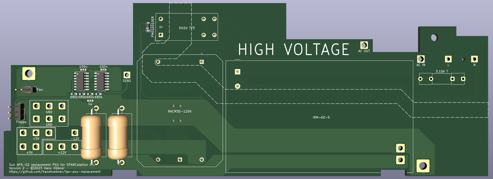
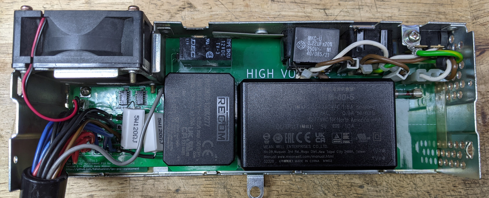
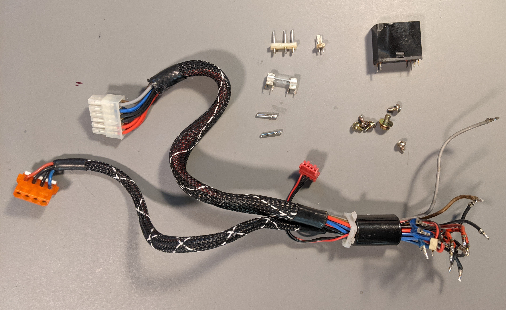

# Sun SPARCstation IPC/IPX replacement power supply

I've got tired of unsuccessfully trying to repair the APS-02 power
supply that is built into Sun's SPARCstation IPC and IPX workstations,
so I designed this replacement.  It uses two encapsulated power
supplies and a MAX8215 power supply monitoring chip to generate the
SENS signal.

Here's a picture of my version 1 build.  It has the base load
resistors bodged on.  The layout has been revised since:

Several parts out of the original PSU board are reused and need to be
desoldered:

|Ref |Qnty|Value    |Notes                                         |
|----|----|---------|----------------------------------------------|
|F1  |1   |3.15A T  |Fuse + fuse holder                            |
|J1  |1   |L        |Power input (3 pin, middle pin not connected) |
|J2  |1   |AC IN    |Power from IEC input (1 pin)                  |
|J5  |1   |AC OUT   |Power to IEC output (1 pin)                   |
|J12 |1   |Fan      |Power to fan (2 pin)                          |
|K1  |1   |DH2U TV3 |IEC output relay                              |
|    |1   |         |Cable harness including floppy connector      |

Another couple of parts need to be bought

|Ref           |Qnty|Value      |Description                                                                 |
|--------------|----|-----------|----------------------------------------------------------------------------|
|U1            |1   |74HCT11D   |Triple 3-input NOR, SO-14                                                   |
|U2            |1   |MAX8215CSD |Voltage Monitor IC, SO-14                                                   |
|D1            |1   |PMEG2010ER |50V 1A General Purpose Rectifier Diode, SOD-123                             |
|C1, C2        |2   |100nF      |Capacitor bipolar SMD 0603                                                  |
|C3            |1   |1µF        |Capacitor bipolar SMD 0603                                                  |
|R1, R2, R3, R4|4   |680kΩ      |Resistor SMD 0603                                                           |
|R5, R6        |2   |120Ω       |Resistor radial 5W, 20mmx9mmx9mm, 25mm pitch                                |
|PS1           |1   |IRM-60-5   |MeanWell IRM-60-5 50 Watt AC/DC power supply, 5V, 10A                       |
|PS2           |1   |RACM30-12DK|RECOM RACM30-24SK/277 30 Watt Dual Output AC/DC power supply, ±12V, ±1250mA |
